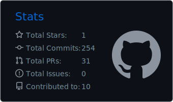
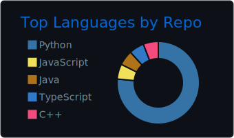

<h1 align="center">Denis Avramenko</h1>
<h3 align="center">Python Backend Developer • FastAPI • PostgreSQL • System Design</h3>

  

  
  
  

## About me

* Python backend developer with commercial experience
* Build APIs, async services and database-driven systems
* Interested in backend architecture, auth, RBAC and performance
* Worked on fintech and backend systems for chess game analysis
* Love building non-trivial pet projects, including my own interpreted language on F#

## Tech Stack

  

## Featured Projects

### ♟️ Chess Analysis Backend

Backend for uploading and analyzing chess games with support for background tasks, multiple analysis strategies and result processing.

### 🧪 MD-Sharp

Experimental interpreted programming language written in F# with custom syntax, parser, AST and evaluator.

### 🤖 Telegram Bots & Pet Projects

Backend-focused projects with real-world flows, persistence, integrations and automation.

## GitHub Stats

  <picture>
    <source media="(prefers-color-scheme: dark)" srcset="./profile-summary-card-output/github_dark/3-stats.svg" />
    <source media="(prefers-color-scheme: light)" srcset="./profile-summary-card-output/github/3-stats.svg" />
    
  </picture>
  <picture>
    <source media="(prefers-color-scheme: dark)" srcset="./profile-summary-card-output/github_dark/1-repos-per-language.svg" />
    <source media="(prefers-color-scheme: light)" srcset="./profile-summary-card-output/github/1-repos-per-language.svg" />
    
  </picture>

## Selected Repositories

  <a href="https://github.com/den4ik2975/MD-Sharp"><b>MD-Sharp</b></a> •
  <a href="https://github.com/Madagascam/backend"><b>Chess Analysis Backend</b></a>

## Contribution Snake

  <picture>
    <source media="(prefers-color-scheme: dark)" srcset="https://raw.githubusercontent.com/den4ik2975/den4ik2975/output/github-contribution-grid-snake-dark.svg" />
    <source media="(prefers-color-scheme: light)" srcset="https://raw.githubusercontent.com/den4ik2975/den4ik2975/output/github-contribution-grid-snake.svg" />
    
  </picture>

